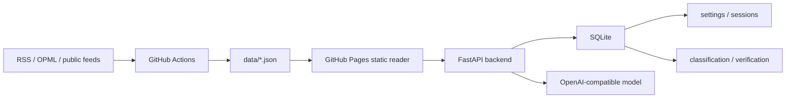

<div align="center">

# AI News Radar Enhance

## 基于原项目的个人 AI Reader 增强版

**GitHub Pages 负责公开 24 小时 AI 雷达，FastAPI 后端负责登录、核验、分类设置和问 AI。**

[](https://withyouda.github.io/ai-news-radar-enhance/)
[](https://github.com/WithYouda/ai-news-radar-enhance/actions/workflows/update-news.yml)

[在线页面](https://withyouda.github.io/ai-news-radar-enhance/) · [English](README.en.md) · [伯乐Skill](skills/ai-news-radar/README.md) · [信息源策略](docs/SOURCE_COVERAGE.md) · [后端说明](server/README.md)

</div>

---

## 项目来源

本仓库基于原项目 [LearnPrompt/ai-news-radar](https://github.com/LearnPrompt/ai-news-radar) 改造而来。原项目已经提供了静态 AI 新闻雷达、RSS/OPML 抓取、GitHub Actions 自动刷新、GitHub Pages 发布、伯乐Skill 等基础能力。

这个增强版保留原项目的静态发布方式和信源策略，在此基础上增加一个自托管 AI 后端，把它改造成更适合个人长期使用的 AI Reader：

- 静态前端仍然可以只靠 GitHub Pages 运行。
- 公开新闻数据仍然由 GitHub Actions 生成 `data/*.json`。
- 私密配置、管理员登录、核验记录、设置项和模型 API Key 留在自己的服务器。
- 前端在没有后端时会降级为普通静态雷达；配置后端后才启用问 AI、深度核验和设置保存。

## 当前能力

- `今日`：展示过去 24 小时 AI 强相关更新、伯乐精选、站点筛选、源健康状态和 WaytoAGI 更新。
- `分类`：按模型与产品、开发者工具、研究与评测、资本与生态等分类查看更新。
- `核验`：对新闻来源做权威性评分，支持单条深度核验，并把结果写入后端 SQLite。
- `设置`：管理员登录后保存深度核验开关、Top N 等个人设置。
- `问 AI`：对今日、分类、单条新闻或核验上下文提问，由后端调用 OpenAI-compatible 模型并返回带引用的回答。
- `移动端/PWA`：保留桌面阅读体验，同时提供移动端底部导航和 Web App 安装入口。
- `伯乐Skill`：继续用于信源判断、RSS/OPML 接入、源覆盖策略和 Agent 交接。

## 架构



核心原则：

- 公共页面只发布可以公开的数据。
- 私有 OPML、API Key、管理员密码、cookies、tokens 和真实 `.env` 不进仓库。
- AI 后端是可选增强，不是静态页面运行的前提。
- 后端建议只监听 `127.0.0.1:8090`，通过 HTTPS 反向代理暴露给前端。

## 本地运行静态站点

需要 Python 3.11。当前后端和部分工具使用 `datetime.UTC`，Python 3.10 会失败。

```bash
git clone https://github.com/WithYouda/ai-news-radar-enhance.git
cd ai-news-radar-enhance

python3.11 -m venv .venv
source .venv/bin/activate
pip install -r requirements.txt

python scripts/update_news.py --output-dir data --window-hours 24
python -m http.server 8080
```

打开：

```text
http://localhost:8080
```

如果要使用自己的 OPML：

```bash
cp feeds/follow.example.opml feeds/follow.opml
# 编辑 feeds/follow.opml，放入自己的订阅源；不要提交这个文件
python scripts/update_news.py --output-dir data --window-hours 24 --rss-opml feeds/follow.opml
```

## 部署 GitHub Pages 和自动更新

GitHub Pages：

```text
Settings -> Pages -> Deploy from branch -> master / root
```

GitHub Actions 已配置 `.github/workflows/update-news.yml`：

- 默认每小时运行一次。
- 使用 Python 3.11。
- 自动生成并提交公开快照：`data/latest-24h.json`、`data/latest-24h-all.json`、`data/archive.json`、`data/source-status.json` 等。
- 如果没有设置私有 OPML，会使用 `feeds/follow.example.opml` 演示 RSS/OPML 能力。
- 如果设置 `FOLLOW_OPML_B64`，会解码为私有 `feeds/follow.opml`，但不会提交该文件。

常用配置：

```text
Secrets:
FOLLOW_OPML_B64
AGENTMAIL_API_KEY
AGENTMAIL_INBOX_ID
X_BEARER_TOKEN

Variables:
RSS_MAX_FEEDS=10
EMAIL_DIGEST_ENABLED=0
EMAIL_DIGEST_PUBLISH=0
X_API_ENABLED=0
```

私有邮箱摘要和 X API 默认关闭。只有明确开启并提供密钥时才会运行；`data/email-digest.json` 也只有在 `EMAIL_DIGEST_PUBLISH=1` 时才会发布。

## 部署 AI 后端

后端目录是 `server/`，服务是 `server.ai_radar_api.main:app`。它提供登录、设置、分类、核验和问 AI API。

本地启动：

```bash
python3.11 -m venv .venv-server
source .venv-server/bin/activate
pip install -r server/requirements.txt

RADAR_ADMIN_PASSWORD=change-me \
RADAR_SESSION_SECRET=change-me-long-random-value \
AI_BASE_URL=https://api.example.com/v1 \
AI_API_KEY=sk-placeholder \
AI_MODEL=gpt-4.1-mini \
uvicorn server.ai_radar_api.main:app --host 127.0.0.1 --port 8090
```

健康检查：

```bash
curl http://127.0.0.1:8090/health
```

生产环境至少配置：

```text
RADAR_PUBLIC_BASE_URL=https://withyouda.github.io/ai-news-radar-enhance
RADAR_ALLOWED_ORIGINS=https://withyouda.github.io
RADAR_ADMIN_PASSWORD=<strong password>
RADAR_SESSION_SECRET=<long random value>
RADAR_DB_PATH=server/data/radar.db
RADAR_MAX_CONTEXT_ITEMS=40
RADAR_DEEP_VERIFY_TOP_N=3
AI_BASE_URL=<OpenAI-compatible base URL>
AI_API_KEY=<provider API key>
AI_MODEL=gpt-4.1-mini
```

PM2 示例：

```bash
pm2 start ".venv-server/bin/uvicorn" --name ai-news-radar-api -- server.ai_radar_api.main:app --host 127.0.0.1 --port 8090
pm2 save
```

反向代理目标：

```text
Public HTTPS -> 127.0.0.1:8090
```

然后在静态站点的 `assets/config.js` 配置后端地址：

```javascript
window.AI_NEWS_RADAR_CONFIG = {
  apiBaseUrl: "https://<server-domain>",
};
```

更细的后端说明见 [server/README.md](server/README.md)。

## 安全和数据边界

不要提交：

- `feeds/follow.opml`
- `.env` 或真实环境变量文件
- API Key、cookies、tokens、管理员密码
- 私有邮箱正文、私有订阅源原文
- 本地手工生成的 `data/*.json`

可以提交：

- `feeds/follow.example.opml`
- `server/.env.example`
- 公开文档、公开信源策略、公开示例配置
- GitHub Actions 自动生成的公开新闻快照

如果接入私有 newsletter 或邮箱，默认只在服务端使用；除非你明确确认内容可以公开，否则不要把它写入 Pages 会发布的 `data/*.json`。

## 给 Agent 的接手入口

新 Agent 接手时建议先读：

- [skills/ai-news-radar/SKILL.md](skills/ai-news-radar/SKILL.md)
- [skills/ai-news-radar/README.md](skills/ai-news-radar/README.md)
- [docs/SOURCE_COVERAGE.md](docs/SOURCE_COVERAGE.md)
- [docs/V2_PRODUCT_BRIEF.md](docs/V2_PRODUCT_BRIEF.md)
- [docs/GPT_HANDOFF.md](docs/GPT_HANDOFF.md)
- [server/README.md](server/README.md)

常用验证命令：

```bash
pip install -r requirements-dev.txt
python -m py_compile scripts/update_news.py
python -m py_compile server/ai_radar_api/*.py
python -m pytest -q
node --check assets/app.js
node --check sw.js
git diff --check
```
